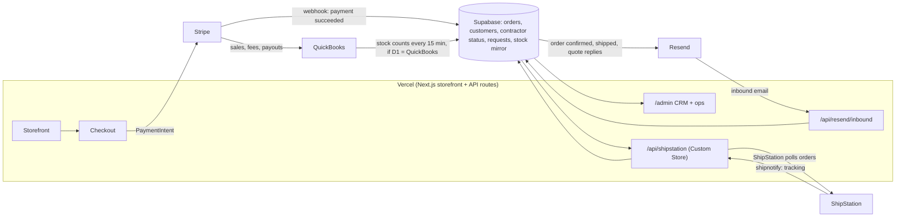

# Summit pipeline architecture plan

Status: phases 1–4 built (2026-10-04) using the recommended answer to each decision in section 3; phase 5 is an app install and phase 6 is per-person setup, both documented in `BACKEND_SETUP.md` (§7–9). The status table in section 6 is current.
Source: the two "Summit Pipeline with Vercel" sketches (2026-10-04).
Goal: the owner runs the counter; online orders, payments, shipping, customer email and books run themselves; staff touch only exceptions.

## 1. What the sketches say

**Sketch 1 (full)**

- Storefront → **ShipStation**: packing lists and slips, barcode scanning, mobile picking, product catalogs, inventory sync, order routing, multiple users.
- **SQL database**: all inventory data, which ShipStation pulls from; customer login; customer status (contractor / not contractor).
- ShipStation → **Stripe** (automated payments, all currencies) → **Atlas ERP** (inventory) → **Resend** (customer service, complaints, contact) → back into the SQL database.
- Customer status → **QuickBooks** (administrative, accounting).

**Sketch 2 (simplified):** same as sketch 1, but **Atlas ERP and QuickBooks are gone**. Stripe goes straight to Resend.

## 2. Recommended architecture

Sketch 2 is the right direction: fewer systems, less to keep in sync. Keep QuickBooks, though, for accounting only. Six changes make it work as an automated pipeline:

1. **Pay before you ship.** The sketch draws ShipStation → Stripe. The order has to be Storefront → Stripe → database → ShipStation. A label should never be printed for an unpaid order.
2. **One inventory count, not four.** Sketch 1 holds inventory in Atlas ERP, the SQL database, ShipStation's inventory sync and QuickBooks. Pick one system that counts stock (decision D1). Every other system receives a copy and never edits it.
3. **Drop Atlas ERP.** Everything it would do is already covered: QuickBooks or Supabase counts stock, ShipStation picks and ships, and Stripe takes payment. It adds a fourth inventory copy and has no integration path we can see.
4. **ShipStation does not read a database directly.** It either *pulls* orders from an endpoint we host (Custom Store), or we *push* orders to its API (decision D2). Both work with Supabase as the source.
5. **Resend sends and receives email; it is not a help desk.** Complaints and contact requests need an inbox where someone can see and close them. Resend inbound email posts each message to us. We store it in Supabase and work it in a staff CRM view inside the existing `/admin`.
6. **QuickBooks receives money, not customer status.** Contractor vs. homeowner status lives in Supabase (it gates trade pricing). QuickBooks gets the Stripe sales, fees and payouts so the books reconcile, plus a customer record for contractors on net terms.

### What each system owns

| System | Owns | Never does |
|---|---|---|
| Vercel / Next.js | Storefront, checkout, API routes, `/admin` CRM | Store data in its own state |
| Supabase | Orders, customers, login, contractor status, requests, the stock mirror shown on the site | Count physical stock (unless D1 = Supabase) |
| Stripe | Taking money, refunds, disputes | Decide what ships |
| ShipStation | Picking, packing slips, barcode scanning, labels, tracking | Hold the master inventory count |
| Resend | Sending transactional email; receiving support email | Hold the support queue (Supabase does) |
| QuickBooks | Accounting, AR, reconciliation; stock counts if D1 = QuickBooks | Customer login or pricing tier |

## 3. Decisions to make

| # | Decision | Options | Recommendation |
|---|---|---|---|
| D1 | Which system counts stock? | **QuickBooks**: the owner already keeps it there, and the repo already syncs it every 15 minutes. Or **Supabase**: we become the system of record, and QuickBooks gets only accounting entries. | QuickBooks for now; it is what the counter uses. Revisit if online volume outgrows it. |
| D2 | How do orders reach ShipStation? | **Custom Store (pull)**: ShipStation polls our endpoint and posts tracking back. Or **API push**: we call ShipStation when an order is paid. | Custom Store. It matches the sketch's "ShipStation pulls from SQL" and needs no retry logic on our side. Confirm your ShipStation plan includes Custom Store. |
| D3 | How do Stripe sales reach QuickBooks? | **Stripe's own QuickBooks app**: free, limited. Or **a sync app** (Synder, Acodei): paid, handles fees and refunds. Or **custom code**. | An app, not custom code. Start with Stripe's free app; upgrade if the books need fee and refund detail. |
| D4 | Keep Atlas ERP? | Keep or drop | Drop (sketch 2 already does). |
| D5 | Where do complaints and contact live? | **A Supabase queue plus the `/admin` CRM view**, or a help desk (Zendesk, Front) | The Supabase queue. The site's contact, quote, homeowner and dealer forms already write there. |

## 4. The automated flows

Each flow runs without anyone clicking. A person is needed only at the step marked **Human**.

**F1. Online order, from paid to shipped**

1. The buyer checks out, and Stripe confirms payment by webhook.
2. The webhook marks the order paid in Supabase, reserves stock and queues a confirmation email through Resend.
3. ShipStation polls `/api/shipstation`, which returns paid, unshipped orders.
4. **Human:** the counter picks, packs and buys the label in ShipStation (barcode scan, packing slip).
5. ShipStation posts tracking back. The order is marked shipped, and Resend sends the shipped email.

**F2. Quote and contact requests**

1. A form submission lands in Supabase.
2. A database trigger creates a task with a due time and logs the activity.
3. Resend sends the customer an acknowledgement with their reference number.
4. **Human:** staff reply from the `/admin` CRM view.
5. Closing the request closes the task.

**F3. Support email**

1. A customer emails `support@` and Resend receives it.
2. Resend posts `email.received` to `/api/resend/inbound`. Because the webhook does not include the message body, the route fetches the body from Resend's receiving API.
3. The route stores the message as a contact request, matching the sender's email to an existing customer. F2 takes over from here.

**F4. Contractor status**

1. A contractor applies, and staff verify the license.
2. **Human:** approve once in `/admin`.
3. The approval flips the account's status, which unlocks trade pricing at login.
4. If the contractor buys on terms, create the matching QuickBooks customer (manual at first; automate once volume justifies it).

**F5. Books and stock**

- **Every 15 minutes:** QuickBooks stock counts sync into Supabase (D1).
- **Continuously:** Stripe sales sync into QuickBooks (D3).
- **Monthly:** the existing AR-statements job emails open balances.

## 5. AI and MCP: what each tool offers

Every system except Atlas ERP has an official MCP server, so Claude can work with it directly. MCP is for asking questions and doing one-off jobs. The automation itself runs on webhooks and scheduled jobs, which work whether or not anyone is talking to an AI.

| System | Official MCP | Good for |
|---|---|---|
| Supabase | Yes (already connected) | "Which quotes are older than two days?", data fixes, migrations |
| Stripe | Yes, hosted at `mcp.stripe.com` | Refunds, dispute lookups, payment links |
| Resend | Yes, hosted at `mcp.resend.com/mcp` | Send a one-off email, check delivery, read inbound mail |
| ShipStation | Yes (API MCP, runs locally with an API key) | Rates, label status, batch questions |
| QuickBooks | Yes (Intuit, early preview, runs locally) | Read-only reporting at first; Intuit positions it for testing, not live books |
| Vercel | Yes (already connected) | Deploys, logs |
| Atlas ERP | None found | Another reason to drop it |

**Build or buy the CRM?** Build a thin one. Customers, requests, quotes, orders, invoices, tasks and notes already live in Supabase; the tables exist. A bought CRM (HubSpot and similar) would be a sixth system to sync. The CRM is a staff view in the existing `/admin`, plus a few database triggers.

## 6. What already exists

| Piece | Status | Where |
|---|---|---|
| Storefront, checkout, Stripe payments | Built | `src/app`, `src/app/api/stripe` |
| Stripe webhook → order paid | Built | `supabase/functions/stripe-webhook` |
| Receipt and lifecycle emails via Resend | Built | `supabase/functions/send-receipt`, `src/lib/backend/email.ts`, cron 033 |
| Login, retail vs. trade accounts, contractor verification | Built | migrations 012, 026, 030; `/admin/dealers` |
| QuickBooks → stock sync (every 15 min) | Built | `supabase/functions/quickbooks-inventory-sync`, cron 024 |
| AR statements, low-stock alerts | Built | `supabase/functions/ar-statements`, `low-stock-alert` |
| Quote, contact, homeowner and dealer request tables | Built | migrations 005, 027, 029 |
| CRM tables (accounts, contacts, tasks, notes, activity) | Tables exist; not used in the UI | migration 001 |
| **Customer view** (`/admin/customers`): everyone who gave an email, with persona, stage, orders and line items, requests, emails sent, interests, timeline and follow-ups | **Built** | `src/lib/crm/people.ts`, `src/lib/backend/customers.ts`, `src/app/admin/customers` |
| Email log (every send recorded, including the edge functions) | **Built**; migration 036 applied to the live project | `email_messages`, `src/lib/backend/email.ts` |
| Live updates (private Realtime "crm" topic, staff only, no customer data in events; focus and 30 s poll fallback) | **Built**; migration 037 applied to the live project | `src/components/admin/live-refresh.tsx` |
| `/admin` operations dashboard | **Shows seeded demo data only**; live queries not written | `src/app/admin/page.tsx` |
| ShipStation integration (Custom Store: export paid/net-terms orders, ship notices record the shipment, release stock and send one "shipped" email) | **Built**; needs ShipStation store credentials (`BACKEND_SETUP.md` §7) | `src/app/api/shipstation`, `src/lib/shipstation`, `record_external_shipment` (038) |
| Resend inbound support email, plus delivery outcomes (delivered, opened, bounced) on every logged email | **Built**; needs a receiving domain and webhook secret (§8) | `src/app/api/resend/webhook`, `src/lib/support/inbound.ts` |
| Stripe → QuickBooks sales sync | Not started: install an app (D3); no code | — |
| Auto-tasks: new request → task due next business day 5 pm; closing the request completes it; staff close quotes and messages from the customer view | **Built**; migration 038 applied and verified on the live project | `private.crm_task_for_request`, `src/app/admin/customers/actions.ts` |
| Checkout's `buyer_phone`, `buyer_company` and `po_number` columns | **Fixed**: they were missing from the live database, so every real checkout failed at the order insert | migration 038 |

The live Supabase project behind all this is the one named **crm** in your Supabase account. All of the site's migrations are applied there.

## 7. Build order

Each phase leaves the business better off on its own.

| Phase | Work | Done when |
|---|---|---|
| 0. Decide | Answer D1–D5 | Built with the recommended answers: D1 QuickBooks counts stock, D2 Custom Store, D3 an app, D4 drop Atlas, D5 Supabase queue. Changing D1 or D2 later means revisiting the stock sync or the ShipStation endpoint. |
| 1. CRM on live data | `/admin/crm`: an inbox of every open request, customers with lifetime value and balance, a quote-to-cash pipeline, tasks; account pages with notes and tasks. Replace the seeded admin numbers with live queries. | Staff work every request from one screen; no demo numbers left in `/admin` |
| 2. Auto-tasks | Migration: new request → task plus activity entry; request closed → task closed. The trigger can never block a customer's submission. | Every submission appears as a task within seconds |
| 3. ShipStation | `/api/shipstation` Custom Store endpoint (export orders, receive shipnotify); shipped email via Resend | A paid test order appears in ShipStation, and the label posts tracking back to the order |
| 4. Support inbox | Resend receiving domain, `/api/resend/inbound` webhook (signature-verified), sender matched to customer | An email to support@ becomes a CRM item linked to the right customer |
| 5. Books | Install the Stripe→QuickBooks app (D3); map accounts with the bookkeeper | A day's Stripe payout reconciles in QuickBooks without manual entry |
| 6. AI layer | Connect the Stripe, Resend and ShipStation MCPs to Claude for staff; read-only keys where possible | Staff can ask "what shipped late this week?" and get an answer |

Phases 1 and 2 need no new vendors. Phase 3 needs ShipStation API credentials, and Phase 4 needs a receiving domain on Resend.

## 8. Risks

- **Stock drift:** two systems both editing stock. Mitigation: D1, with exactly one writer.
- **Unpaid orders shipped:** the Custom Store endpoint must return only paid orders, and the e2e suite should test it.
- **Webhook spoofing:** verify Stripe, Resend and ShipStation signatures or basic auth on every inbound route. The existing Stripe function already does this.
- **The QuickBooks MCP is a preview:** do not give it write access to the live books.
- **Public repository:** API keys stay in Vercel and Supabase environment variables, never in the repo. This repo already keeps unit costs out for the same reason.

## Sources

- [ShipStation MCP](https://docs.shipstation.com/connect-mcp)
- [ShipStation Custom Store developer guide (example implementation)](https://www.warehance.com/support-center/marketplaces/custom-store-interface-developer-guide)
- [Stripe MCP](https://mcpservers.org/remote-mcp-servers/stripe)
- [Resend MCP](https://resend.com/changelog/mcp)
- [Resend inbound email](https://resend.com/docs/dashboard/receiving/introduction)
- [Resend `email.received` webhook](https://resend.com/docs/webhooks/emails/received.md)
- [QuickBooks Online MCP (Intuit)](https://www.numeric.io/blog/quickbooks-mcp)
- [Stripe and QuickBooks sync options](https://www.shuttleglobal.com/blog/maximize-invoice-payments-in-quickbooks-with-stripe-integration/)
